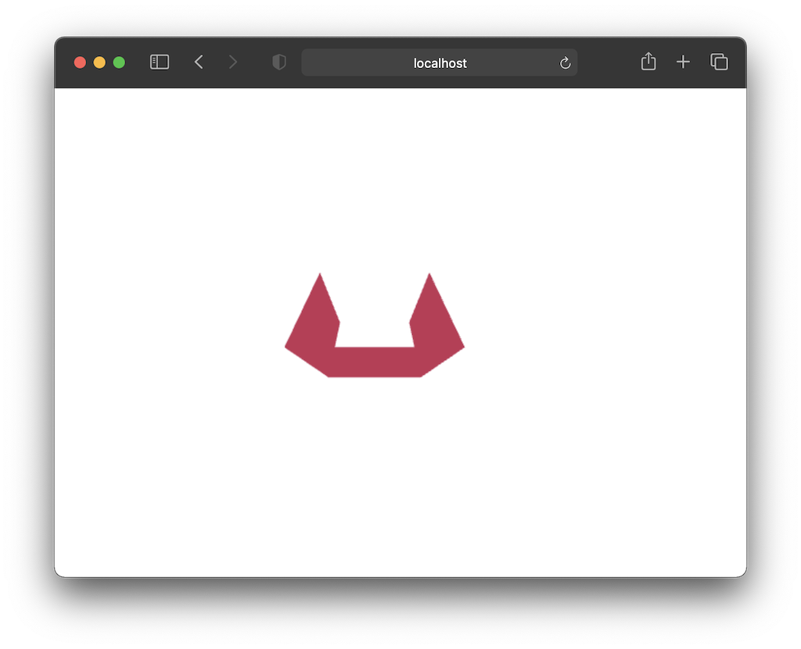

<br/>



##### Todo
- Create delta from mouse input
- Decide how to handle state updates (calculating and setting matrix values) from browser callbacks e.g. mouse/keyboard

##### Glossary / Ramblings

##### Expressing matrices in JS/TS

Is there any point in providing more structure to vectors and matrices given that WebGL only accepts them as an array of floats anyway? 

I was motivated for a better solution due to the cumbersome way in which I was writing tests for matrix functions. For example, in order to test `rotateX` each basis vector of the resulting matrix needs to be inspected for the correct values. Because the format is unchanged from what WebGL requires that means pulling out 4 values (`x, y, z, w`) from a 16 value array (3 basis vectors each of 4 components + `w` vector to support affine transformations). Needless to say this is error prone.

```typescript
let rotated = rotateX(rads(90));

expect(rotated[0]).toEqual(1);
expect(rotated[1]).toEqual(0);
expect(rotated[2]).toEqual(0);
expect(rotated[3]).toEqual(0);
// or
expect([rotated[0], rotated[1], rotate[2], rotated[3]]).toEqual([1,0,0,0]);
```

Could I define a type such that I don't have to build each vector picking indices? The first attempt was super structured – a matrix was defined in terms of a certain dimension of vector. A matrix defined in terms of `Vec2` would have `x`and `y` vectors each of which had `x` and `y` components. A matrix of `Vec3`would have `x`, `y` and `z` with each vector having three components. A matrix of `Vec4`would have 4 and so on.

```typescript
type Vec2 =
{
  [ B in "x" | "y" ]:number
}

type Vec3 =
{
  [ B in "x" | "y" | "z" ]:number
}

type Vec4 =
{
  [ B in "x" | "y" | "z" | "w" ]:number
}

type Matrix<T extends Vec2 | Vec3 | Vec4> = { [Prop in keyof T]:T }

let m:Matrix<Vec2> =
{
  x: { x:1, y:2 },
  y: { x:4, y:5 }
}

let m:Matrix<Vec3> =
{
  x: { x:1, y:2, z:3 },
  y: { x:4, y:5, z:6 },
  z: { x:7, y:8, z:9 }
}
```

As nice and structured as this is, it feels to cumbersome and fiddly when it comes to using them in functions such as `components(m:Matrix<Vec4>)` which returns values of the matrix `m` grouped by component.

```typescript
function components(a:Matrix<Vec4>) {
  return {
    x: [ a.x.x, a.y.x, a.z.x, a.w.x ],
    y: [ a.x.y, a.y.y, a.z.y, a.w.y ],
    z: [ a.x.z, a.y.z, a.z.z, a.w.z ],
    w: [ a.x.w, a.y.w, a.z.w, a.w.w ]
  }
}
```

In cases like this, using objects with a key for each basis vector and component is too clunky. We're almost back where we started getting confused on what values we're pulling from where. The naming of every component and basis' vector can still make things confusing.

The next approach I tried was based on a thought that maybe I didn't need a heavily labelled data structure like a map-of-maps which required me to write/read items via labels, *all* the time. Instead, I needed labels only *some* of the time i.e when pulling vertices out. Enter vectors and destructuring.

```typescript
type Vec2 = [ number, number ]

type Vec3 = [ number, number, number ]

type Matrix<V extends Vec2 | Vec3> =
{
  [ _ in keyof V ]: V
}

let m:Matrix<Vec2> =
[
  [ 1,2 ],
  [ 1,2 ]
]

let n:Matrix<Vec3> =
[
  [ 1,0,0 ],
  [ 0,1,0 ],
  [ 0,0,1 ]
]
```

This enables a compact creation whilst allowing the retrieval of components to be named via destructuring.


##### Model Space

The coordinate space in which the centre of the model is always at the origin.


##### World Space

The coordinate space which all other models are placed within and moved relative to one another.


##### Screen Space

> ...perform a perspective divide on the points in camera space to compute their coordinates in screen space
>
> – [www.scratchpixel.com](https://www.scratchapixel.com/lessons/3d-basic-rendering/3d-viewing-pinhole-camera/virtual-pinhole-camera-model)


##### Camera Space


##### NDC Space


##### Homogenous Coordinates

Are something to help us deal with affine transformations. An affine transformation is one that preserves parallel relationships – think translation.

> In fact, the typical perspective projection matrix uses the division by the w component to achieve its transformation


##### Vertex shaders

> ...(a vertex shader's) job is to transform vertices making up the 3D objects of your scene from *camera space to clip space*
>
> [– www.scratchapixel.com](https://www.scratchapixel.com/lessons/3d-basic-rendering/perspective-and-orthographic-projection-matrix)

> <u>Each time a shape is rendered</u>, the vertex shader is run for each vertex in the shape. Its job is to transform the input vertex from its original coordinate system into the <u>clip space</u> coordinate system.
>
> [– MDN](https://developer.mozilla.org/en-US/docs/Web/API/WebGL_API/Tutorial/Adding_2D_content_to_a_WebGL_context)

What determines when a shape is rendered?

- `gl.drawArrays(..)`

What are clip space coordinates?

- Coordinates in the range [-1, 1]


##### Fragment shaders

> The fragment shader is called once for every pixel on each shape to be drawn.

The fragment shader is to deliver a colour for each pixel of the shape by calculating the corresponding <u>texel</u> and applying lighting to result in an overall colour.


##### Varyings

##### Texel


##### Attributes

Provides values for the vertex shader.

Receive values from buffers.

> Each iteration of the vertex shader receives the next value from the buffer assigned to that attribute


##### Uniforms

Stay the same for all iterations of a shader e.g. view model matrix


##### Buffer

##### Creating a program

Using `gl`, create a shader object sending it the source and compile the shader. Do this for each shader.

```javascript
const shader = gl.createShader(type)
gl.shaderSource(shader, source)
gl.compileShader(shader)
```

Using `gl`, create a program, attach the shaders then call `linkProgram()`

```javascript
let shaderProgram = gl.createProgram();
gl.attachShader(shaderProgram, vertexShader);
gl.attachShader(shaderProgram, fragmentShader);
gl.linkProgram(shaderProgram);
```


When a vertex shader specifies attributes or uniforms, these are called <u>inputs</u>. The compiled program has a set memory layout and in order to get our data into these <u>inputs</u> we need to know where in memory they have been located, which means we need to compile our sources in order to find out where they go.

> After we've created a shader program we need to look up the locations that WebGL assigned to our inputs.

```javascript
let programInfo = {
  program: shaderProgram,
  attribLocations: {
    vertexPositions: gl.getAttributeLocation(shaderProgram, 'aVertexPosition'),
  },
  uniformLocations: {
    projectionMatrix: gl.getUniformLocation(shaderProgram, 'uProjectionMatrix'),
    modelViewMatrix: gl.getUniformLocation(shaderProgram, 'uModelViewMatrix')
  }
}
```


To get data into <u>inputs</u> we use <u>buffers</u> 


###### Buffers 'n' Bind Points

A big portion of WebGL is about setting state. In order to do that WebGL offers "bind points" for example `ARRAY_BUFFER`. Implicitly WebGL can only work on one particular bind point at a time – though there are multiple bind points. In the case of `ARRAY_BUFFER` we set that to some particular buffer (that we've created through `createBuffer()`) and subsequent buffer operations affect whatever buffer is bound to `ARRAY_BUFFER`. 

> Nearly all of the entire WebGL API is about [setting up state](https://webgl2fundamentals.org/webgl/lessons/resources/webgl-state-diagram.html) for these pairs of functions to run
>
> [webgl2fundamentals.org](https://webgl2fundamentals.org/webgl/lessons/webgl-fundamentals.html)


##### Projection Matrices

Why and how

##### Rotation Matrices

Why and how
